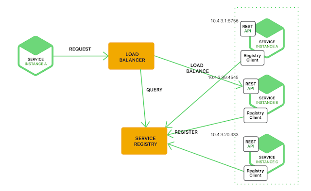

[]

## Phase Approach

## Maturity Model

## Design Principles
- Design for Failure
- Design for Security

## Advantages of Microservices
- Loosely Coupled
- Boundary context to encapsulate a business function
- Highly scalable
- Embrace polyglot

## Challenges

### Designing Challenges
1. Breaking Microservices:
  - Monolithic Application
  - Green Field Development

2. Flow Design & analysis - Application functionality is Implemented by orchestrating a services of Microservices which may make it difficult to have functional traceability and chain of communication. This can lead to domino effect when on microservice fails.

3. Micro Database (polyglot) - Modularizing a huge relational database into micro database is a challenge. Go in phases
  - Implement service layer over Monolithic db. Build database which can build additional layer of abstraction.
  - Extract data entities - lift and shift
  - Complete microservice database model

4. Micro UI (polyglot)

5. Service Discovery

### Implementation Challenges

### Operation Challenges

1. Monitoring -  Need a better monitoring infrastructure and quick means of building potential breakdowns of a chain.

2. Fault Tolerance
  - Failure mode analysis - Risk analysis on potential failure points and having a proper plan of action. Have failure drills
  - Predictive analysis
  - Chaos Management (Chaos Monkey)
