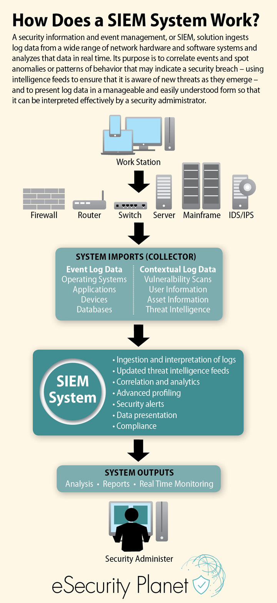

# SIEM

Security Information and Event Management (SIEM) tools monitor logs from network hardware and software to spot security threats, detect and prevent breaches, and provide forensic analysis. Learn everything you need to know to implement a SIEM system.

A SIEM has two closely related purposes: to collect, store, analyze, investigate and report on log and other data for incident response, forensics and regulatory compliance purposes; and to analyze the event data it ingests in real time to facilitate the early detection of targeted attacks, advanced threats, and data breaches.

## How SIEM tools work?

